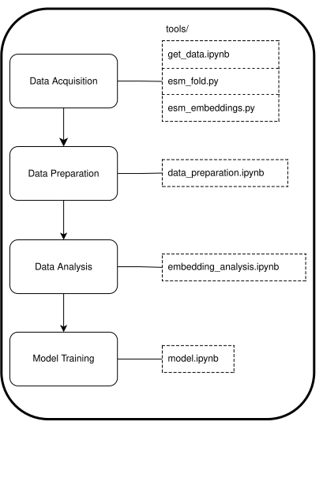

This repository holds a small MLP (Multi-layer perceptron) built with Pytoch, trained on protein embeddings from 116 *E.coli*-infecting phages, as well as *E.coli*. The aim is to show viability of models trained to perform specific tasks, such as protein classification of phage proteins, on data generated using much larger LLMs (in this case ESM3).

# Methods and Results

116 *E.coli*-infecting phages (BASEL phage collection), as well as *E.coli* were selected. All proteins for phages and *E.coli* were downloaded from NCBI. Protein structures were predicted using ESM3, and embeddings produced. InterProScan results for all proteins were calculated and used to classify proteins into the broad categories of: cellular component (cc), biological process (bp), and molecular function (mf). These will later be used as classification targets for the model.
Additionally, sequence and structural clustering was carried out using MMSeqs2 and Foldseek respectively. A sequence-, and structure cluster id was assigned to each protein, used for later analysis. 

Embeddings were preliminarily analysed using TSNE. This showed distinct clusters for related proteins, and reflects the sequential and structural clusterings (Fig. tsne2.png & tsne3.png). Proteins with the same namespace (general function) were clustered together as well. We see a noticeable but expected class imbalance in cellular component proteins: 399 vs. 4702 (molecular function) and 6137 (biological process). For phage proteins only: 190(cc)/1910(mf)/1855(bp). 

Heterogeneous structural clusters (`het_struc_clusters.csv`) are of particular interest, as these can showcase instances of molecular replication employed by phages to bypass bacterial defense strategies. Another point of interest are clusters that include **hypothetical** phage proteins, which are ubiquitos, that are in a cluster with a known e.coli protein. These can be used to infer a potential function for phage proteins, for example cluster `752`.
Another intersting finding is in the cluster right above, `751`. Here, a phage origin tail fiber protein, is in the same cluster as a "putative prophage side tail fiber protein StfR" found in *E.coli*. Prophages integrate their genome into the hosts DNA, and can live and replicate along side them.

A MLP (Multi-layer perceptron) was chosen as the model architecture, as these kinds of neural networks tend to work better with very complex data, such as protein embeddings. As previously mentioned, the classification categories are cellular component (cc), biological process (bp), and molecular function (mf). The input features currently consist only of the fixed-length ESM3 protein embeddings. Additional features, for example binary representation vectors of interpro signatures, could make for better performance.

The classifier consists of two hidden layers with ReLU activations and dropout for regularization, followed by a softmax output layer producing class probabilities. Class imbalance was addressed using a weighted sampling strategy. Training batches were constructed via a `WeightedRandomSampler` to ensure each class was represented about equally, mitigating bias toward the two majority classes (bp and mf).
When comparing a simple fixed weighting scheme, no weights, and the weighted sampling strategy, the model with no weights had a sligth edge. This could also be caused bu overfitting. Weighted sampling performed the second best, while simple weighting significantly reduced model performance.

Performance was monitored on a held out validation set, with metrics including accuracy, precision, recall, and F1-score. We see a string **validation accuracy of 0.80**. This performance has yet to be analyzed, or validated, and results are subject to further optimization. Applicability of this model to phages of different hosts also can be tested.